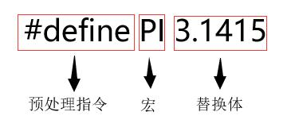
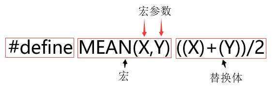
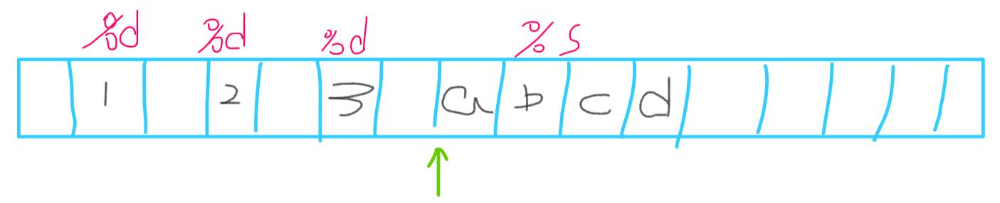

> 本次培训采用C99标准
# Hello World
- ####  你好，世界！
``` C
#include<stdio.h>  // 包含另一个文件

/* 这是一个简单的演示程序 */
int main()   // 函数名
{ // 函数体开始
	int num; // 声明
	num = 1; // 赋值表达式语句
	printf("Hello World\n"); // 调用函数
	return 0; // return 语句
} // 结束
```
- #### 程序细节
  - `#include`：这行代码是C语言预编译指令
  - `int main()函数`：C语言程序一定是从`main()`函数开始执行，并且一个项目只能有一个`main`函数。
      - `void main()`：注意，一些编译器允许这样写，但是所有的标准都未认可这种写法。而`int main()`是标准写法，使用标准写法，在将程序从一个编译器切换到另一个编译器时一般不会出现什么问题。
  - `/* ... */`：这是C语言中的注释，它允许同时注释多行。对于单行注释也可使用`//`。
  - `{ ... }`：这是花括号，一般而言，所有C函数都要使用花括号标记函数体的开始和结束。
  - `int num`：这是声明，声明一个变量一般形式是`关键字 标识符`，例如`char str`。
  - `num = 1`：赋值表达式语句。
  - `printf()`：这是C语言的一个标准输出函数。括号中的`Hello World\n`是这个函数的`实际参数`。
  - `return 0`：C语言标准中，要求main()函数返回0。但如果省略不写这一句呢？程序在运行至最外面的右花括号时会返回0。因此，可以省略main()函数的`return`语句，但是不要在其他有返回值的函数中漏掉它。强烈建议读者养成在main()函数中保留`return`语句的好习惯。

- #### 代码编写规范
  - 标识符命名规范：标识符只能由字母、数字和下划线组成，并且第一个字符必须是字母或下划线
  - 变量名应该有具体含义
  - 每条语句占一行
  - 对齐缩进4个空格字符
  - ...


# 数据类型
- #### C数据类型


- #### 什么是位、字节和字
> 位、字节和字是描述计算机数据单元或存储单元的术语。<br>
> 最小的存储单元是位(bit)，可以储存0或1.虽然1位储存的信息有限，但是计算机中位的数量十分庞大。位是计算机内存的基本构建块。<br>
> 字节(byte)是常用的计算机存储单位。对于几乎所有的机器，1字节均为8位。这是字节的标准定义，至少在衡量存储单位时是这样。既然1位可以表示0或1，那么8位字节就有256（2的8次方）种可能的0、1组合。通过二进制编码（仅用0和1便可表示数字），便可表示0~255的整数或一组字符。<br>
> 字(word)是设计计算机时给定的自然存储单位，对于8位的微型计算机（如，最初的苹果机），1个字长只有8位。从那以后，个人计算机字长增至16位、32位，直到目前的64位，计算机的字长越大，其数据转移越快，允许的内存访问也快的多。<br>
> ————《C Primer Plus》

`注意：C语言把1字节定义为char类型占用的位(bit)数。通常，char类型被定义为8位的存储单元。`

- #### 整数类型
  
|类型|存储大小|值范围|
|-|-|-|
|`char`|1 byte|`-128 到 127 或 0 到 255`|
|unsigned char|1 byte|0 到 255|
|signed char|1 byte|-128 到 127|
|int|2 或 4 bytes|-32,768 到 32,767 或 -2,147,483,648 到 2,147,483,647|
|unsigned int|2 或 4 bytes|0 到 65,535 或 0 到 4,294,967,295|
|short|2 bytes|-32,768 到 32,767|
|unsigned short|2 bytes|0 到 65,535|
|long|4 bytes|-2,147,483,648 到 2,147,483,647|
|unsigned long|4 bytes|0 到 4,294,967,295|

不同平台上数据类型的取值范围有所差异，为了得到某个类型或某个变量在特定平台上的准确大小，可以使用`sizeof`运算符，得到对象或类型的存储字节大小。

``` C
#include<stdio.h>

int main()
{
	printf("Storage size for int : %d \n", sizeof(int));
	return 0;
}
```
输出：
```
Storage size for int : 4
```
按照1个字节8位计算，那4个字节能够存储$2^{4*8}$，即$2^{32} = 4294967296$，正负数各分一半，也就是-2,147,483,648 到 2,147,483,647。


- #### 浮点类型

类型|存储大小|值范围|精度
|-|-|-|-|
float|4 byte|1.2E-38 到 3.4E+38|6 位小数
double|8 byte|2.3E-308 到 1.7E+308|15 位小数
long double|10 byte|3.4E-4932 到 1.1E+4932|19 位小数

- #### 基本数据类型所占字节数与三个方面因素有关
  - CPU位宽（即你的CPU是多少为的）
  - 操作系统位宽（笼统说就是操作系统位数，操作系统位宽取决于CPU位宽）
  - 编译器类型和版本

- #### 整型溢出


- EX.1<br>
计算机中的计算只有二进制加法。因此，计算机在计算时实际上是取它们的补码进行加法运算。
``` C
unsigned int a;
int b = -1;
a = b;
printf("a=%u",a);
```
输出：
```
a=4294967295
```
让我们来分析一下，<br>
首先int型的-1，对应二进制<br>
取原码：`1000000000000000000000000000001`<br>
取反码：`1111111111111111111111111111110`<br>
取补码：`1111111111111111111111111111111`<br>
而`unsigned int`型最大值对应的补码也是它，因此在赋值给`a`后，就得到了它的最大值。

- EX.2<br>
如果整数超出了相应类型的取值范围会怎样？
``` C
#include<stdio.h>

int main()
{
	int i = 2147483647;
	unsigned int j = 4294967295;
	printf("%d %d %d\n", i, i+1, i+2);
	printf("%u %u %u\n", j, j+1, j+2);

	return 0;
}
```
输出：
```
2147483647 -2147483648 -2147483647
4294967295 0 1
```
从输出结果不难发现，当达到它们能表示的最大值时，会重新从起点开始。只不过`unsigned int`最小值为0，而`int`型最小值为-2147483648。

[关于原码、反码和补码更多介绍](https://www.cnblogs.com/zhangziqiu/archive/2011/03/30/ComputerCode.html)

# 明示常量：#define
编译时，在预处理阶段，预处理器会查找一行中以`#`号开始的预处理指令。预处理指令从`#`号开始执行，到后面的第一个换行符为止。也就是说，指令的长度仅限于一行（逻辑行）。

- **类对象宏**


宏的名称同样需要遵守C变量的命名规则：只能使用字符、数字和下划线，且首字符不能是数字。<br>
可以把它看做是一种记号，程序在编译时会把记号替换为它对应的值。

例子：
``` C
#include<stdio.h>
#define WORD "Hello World!"
#define OP 6+6
#define LINE 10

int main()
{
	char str[15] = WORD;
	int sum = OP;

	for(int i = 0; i < LINE; i++)
	{
		printf("%d\t%s\t%d\n", i, str, sum);
	}

	return 0;
}
```

- **类函数宏**<br>
类函数宏可以像函数那样传入参数，它的组成如下



例子：
``` C
#include<stdio.h>
#define MEAN(X,Y) ((X)+(Y))/2

int main()
{
	int mean = MEAN(10, 20);
	printf("%d", mean);

	return 0;
}
```
- 注意：`预处理器不做计算、不求值、只替换字符序列`！！

``` C
#include<stdio.h>
#define SQUARE(X) X*X

int main()
{
	int x = 5;
	printf("%d\n", SQUARE(x));
	printf("%d\n", SQUARE(x+2));
	printf("%d\n", 100/SQUARE(2));

	return 0;
}
```
预处理器仅仅是在编译时替换了字符序列，所以在写替换体时，一定要注意参数的作用范围。此处出现的问题可以通过添加括号解决：`(X)*(X)`。

- **常用的宏**
``` C
#define MAX(X,Y) ((X) > (Y) ? (X) : (Y))
#define ABS(X) ((X) < 0 ? -(X) : (X))
#define ISSIGN(X) ((X) == '+' || (X) == '-' ? 1 : 0)
```
再次强调，宏只是在程序编译时，替换掉记号位置的字符序列。

# 常用运算符
- 常用运算符

赋值|自增自减|算术|逻辑|比较|成员访问|其他
|:-:|:-:|:-:|:-:|:-:|:-:|:-:|
a = b<br>a += b<br>a -= b<br>a *= b<br>a /= b<br>a %= b<br>a &= b<br>a &#124;= b<br>a ^= b<br>a <<= b<br>a >>= b|++a<br>--a<br>a++<br>a--<br>|+a<br>-a<br>a + b<br>a - b<br>a * b<br>a / b<br>a % b<br>~a<br>a & b<br>a &#124; b<br>a ^ b<br>a << b<br>a >> b<br>|!a<br>a && b<br>a &#124;&#124; b<br>|a == b<br>a != b<br>a < b<br>a > b<br>a <= b<br>a >= b<br>|a[b]<br>*a<br>&a<br>a->b<br>a.b<br>|a(...)<br>a, b<br>(type) a<br>? :<br>sizeof<br>_Alignof (C11 起)

[关于C运算符优先级](https://zh.cppreference.com/w/c/language/operator_precedence)
- 位运算符

|运算符|含义|描述|
|-|-|-|
|&|按位与|如果两个相应的二进制位都为1，则该位的结果值为1，否则为0|
|&#124;|按位或|两个相应的二进制位中只要有一个为1，该位的结果值为1|
|^|按位异或|若参加运算的两个二进制位值相同则为0，否则为1|
|~|取反|~是一元运算符，用来对一个二进制数按位取反，即将0变1，将1变0|
|<<|左移|用来将一个数的各二进制位全部左移N位，右补0|
|>>|右移|将一个数的各二进制位右移N位，移到右端的低位被舍弃，对于无符号数，高位补0|


- `i++`与`++i` / `i--`与`--i`
  - ++ 在前面叫做前自增（例如 ++a）。前自增先进行自增操作，再进行其他操作。
  - ++ 在后面叫做后自增（例如 a++）。后自增先进行其他操作，再进行自增操作。
  - 自增自减完成后，会用新值替换旧值，并将新值保存在当前变量中。
  - 自增自减只能针对变量，不能针对数字。

例子：
``` C
#include<stdio.h>

int main()
{
	int a = 5;
	printf("%d\n", ++a);
	printf("%d\n", a++);

	return 0;
}
```
- `sizeof`
  - 它以字节为单位返回运算对象的大小。
  - 对于实值，可省略括号，其他情况不能省略括号。
  - 根据代码的一致性，建议在所有情况下都不要省略括号。
``` C
#include<stdio.h>

int main()
{
	int  a = 5;
	printf("%d\n", sizeof a);
	printf("%d\n", sizeof int);	// 报错 
	printf("%d\n", sizeof(int));

	return 0;
}
```

# printf()和scanf()
这两个函数都采用格式化输入输出，每种数据类型都要使用它对应`转换说明`才能正常输入输出。例如整数要用`%d`，字符要用`%c`。这些符号称为`转换说明`，它们指定了如何把数据转换成可显示的格式。

### printf()
- 转换说明及其打印的输出结果

转换说明|输出
|-|-|
%a,%A|浮点数、十六进制数和p计数法(C99/C11)
%c|一个字符
%d|有符号十进制数
%e,%E|浮点数,e计数法
%f|浮点数，十进制计数法
%g,%G|根据数值不同自动选择%f或%e, %e格式在指数小于-4或者大于等于精度时使用
%i|有符号十进制整数(与%d相同)
%o|无符号八进制整数
%p|指针
%s|字符串
%u|无符号十进制数
%x,%X|使用十六进制数0f的无符号十六进制整数
%%|打印一个百分号

- 有时字符串比较长，需要放在多行
``` C
#include<stdio.h>

int main()
{
	printf("Do not believe what is passed from mouth; \
Do not believe rumors ; Do not believe the \
infallibility of texts") ;

	return 0;
}
```

### scanf()
scanf()函数使用空白（换行符、制表符和空格）把输入分成多个字段。在依次把转换说明和字段匹配时跳过空白。
> `%c转换说明`:它是一个例外，它会读取每个字符，包括空白。

- #### 格式字符串中的普通字符
scanf()函数允许把普通字符放在格式字符串中，这个时候要求，除空格字符外的普通字符必须与输入字符串严格匹配。例如
``` C
printf("%d,%d,%d", &a, &b, &c);
```
那么它对应的输入必须是这种格式
``` 
1,2,3
```

- #### 细化scanf()输入

- 假设scanf()根据一个%d转换说明读取一个整数。

scanf()函数每次读取一个字符，跳过所有空白字符，直至遇到第1个非空白字符才开始读取。scanf()不断地读取和保存字符，直至遇到非数字字符。如果遇到非数字字符，它便认为到了整数的末尾。然后scanf()把非数字字符放回输入。

- 如果第1个非空白字符(记为A)不是数字会怎么样？

scanf()将会停在那里，并把A放回输入中，不会把值赋给指定变量。程序在下一次读取输入时，首先读到的字符是A。如果程序只用了%d转换说明，那么scanf()就一直无法越过A读取下一个字符。另外，如果使用带了`多个`转换说明的scanf()，C规定在第1个出错出停止读取输入。

- %s:

scanf()会跳过空白，读取非空白字符，也就是说通过`%s`读取的字符串不含空白。需要注意的是，当scanf()把字符串放进指定数组中时，它会在字符序列的末尾加上`\0`。

- #### scanf()的返回值
scanf()函数返回成功读取的项数。如果没有任何读取项，且需要读取一个数字而用户却输入一个非数值字符串，scanf()便返回0。当检测到“文件结尾”时，会返回`EOF`。<br>
例子：
``` C
#include<stdio.h>

int main()
{
	char a[20];
	int sign, b, c;
	while(true)
	{
		sign = scanf("%s %d %d", a, &b, &c);
		printf("返回:%d\n", sign);
	}

	return 0;
}
```

由此可作为输入时的循环条件
``` C
while (~scanf("%d %d",&n,&m)) 等效于 while (scanf("%d %d",&n,&m) != EOF)
```

- #### 其他输入输出
  - getchar()
  - putchar()
  - gets()
  - puts()


# 分支语句
- #### if
> **形式：**
> ``` C
> if ( expression2 )
> 	statement1
> else if ( expression2 )
> 	statement2
> else
> 	statement3
> ```
> 如果expression1为真，执行statement1部分；如果expression2为真，执行statement2部分；否则，执行statement3部分

- 在写条件时，注意优先级。例如下面错误的判断是否为字母
``` C
if(ch >= 'a' && ch <= 'z' || ch >= 'A' && ch <= 'Z')
{
	printf("is alphabet")
}
```

- #### 三元运算符：? :
> 条件运算符需要3个运算对象，每个运算对象都是一个表达式。
> *expression1* ? *expression2* : *expression3*
> 如果*expression1*为真，整个条件表达式的值是*expression2*的值；否则，是*expression3*的值。

它可以与`if else`等效，例如
``` C
x = (y < 0) ? -y : y; 

// 等效于
if (y < 0)
	x = -y;
else
	x = y;
```

- #### 多重选择：switch语句
> **形式：**
> ``` C
> switch( expression ) 
> {
> 	case label1: statement1 // 使用break跳出switch
> 	case label2: statement2 
>	default: statement3
> }
> ```
> 可以有多个标签语句，default语句可选。<br>
> **注解：**<br>
> 程序根据expression的值跳转至相应的case标签处，然后，执行剩下的所有语句，除非执行到break语句进行重定向。expression和case标签都必须是整数值（包括char类型），标签必须是常量或完全由常量组成的表达式，如果没有case标签与expression的值匹配，控制则转至标有default的语句（如果有的话）；否则，将转至执行紧跟在wwitch语句后面的语句。

- EX：统计一段话中元音字母个数。
``` C
#include<stdio.h>

int main()
{
	int count = 0;
	char ch;
	while((ch = getchar()) != '\n')
	{
		switch(ch)
		{
			case 'a':
			case 'A':
				count++;
				break;
			case 'e':
			case 'E':
				count++;
				break;
			case 'i':
			case 'I':
				count++;
				break;
			case 'o':
			case 'O':
				count++;
				break;
			case 'u':
			case 'U':
				count++;
				break;
		}
	}
	printf("count: %d", count);

	return 0;
}
```


# 循环语句

### 入口条件循环
顾名思义，入口条件循环就是在循环的每次迭代之前检查测试条件，所以它有可能根本不执行循环体中的内容。
- #### while循环
> **形式:**
>  ``` C
>  while( expression )
> 		statement
>  ```
> 在*expression*部分为假之前，重复执行*statement*部分。

循环输入的例子：
``` C
#include<stdio.h>

int main()
{
	char ch;
	while(scanf("%c", &ch) != EOF)
	{
		if(ch >= '0' &&ch <= '9')
			printf("%c", ch);
	}

	return 0;
}
```
- **何为真假？**<br>
在C语言中这个很好判断，不为0的数就是`真`，即-1,-1000,1,100都为真。只有0为`假`。<br>布尔型的`True == 1`、`False == 0`。
	- EX.1：若成功输入，预测下面代码执行结果。
``` C
#include<stdio.h>

int main()
{
	int num, status;
	int sum = 0;

	status = scanf("%d", &num);

	while(status = 1)
	{
		sum += num;
		if(sum >= 10)
			status = 0;
	}
	printf("%d", sum);

	return 0;
}
```
出现了死循环，`while(status = 1)`实际上相当于`while(1)`，此时入口条件永为真。<br>
这种错误，程序在编译时，编译器一般不会报错（现代编译器会发出警告），为避免出现这种误用情况，经验丰富的程序员一般会把数写在等号左边，这样如果出现误写，在编译时会报错。
``` C
1 = status	// 语法错误
1 == status	// 返回真假
```

- **空语句**<br>
在C语言中，单独的分号表示空语句。有时程序员会故意使用带空语句的while语句，例如，假设你想跳过输入到第1个非空白字符或数字，可以这样写。
``` C
while(scanf("%d", &num) == 1)
	; 			// 跳过整数输入
```
防止误用空语句。以下是常见的几种误用，大括号中的语句仅执行了一次
``` C	
	int i = 0;
	while(i > 5);
	{
		i++;
		printf("%d", i);
	} /* 输出：1*/


	int i;
	for(i = 0; i < 5; i++);
	{
		printf("%d", i);
	} /* 输出：5*/


	int i = 5;
	if(i > 999);
	{
		printf("%d", i);
	} /* 输出：5*/
```

- #### for循环
for循环把初始化、测试和更新三个行为组合在了一处。
> **形式：**
> ``` C
> for ( initialize; test; update )
> 	statement
> ```
> 在*test*为假或0之前，重复执行*statement*。<br>
> **注解：**<br>
> for语句使用3个表达式控制循环过程，分别用分号隔开。initialize表达式在执行for语句之前只执行一次；然后对test表达式求值，如果表达式为真（或非零），执行循环一次；接着对update表达式求值，并再次检查test表达式。for语句是一种入口条件循环，即在执行循环之前就决定了是否执行循环。因此，for循环可能一次都不执行，statement部分可以是一条简单语句或复合语句。

- 输出1到200的奇数，十个为一行
``` C
#include<stdio.h>

int main()
{
	int i;
	for (i = 1; i <= 200; i+=2)
	{
		printf("%d", i);
		printf("%c", (i + 1) % 20 ? '\t': '\n' );
	}
	
	return 0;
}
```

- #### 逗号运算符
> 逗号运算符把两个表达式连接成一个表达式，并保证最左边的表达式最先求值，逗号运算符通常在for循环头的表达式中用于包含更多的信息。整个逗号表达式的值是逗号右侧表达式的值。

上个例子还可以这样写。
``` C
#include<stdio.h>

int main()
{
	int i, k;
	for (i = 1, k = 1; i <= 200; i+=2, k++)
	{
		printf("%d", i);
		if(k % 10 == 0)
			printf("\n");
		else
			printf("\t");
	}

	return 0;
}
```
- 防止误用逗号运算符<br>
举个例子，假如你正在给一个表示房价的变量赋值，它在书上表示的是`$295,500`，然后你在输入的时候，不小心把逗号也输入进去了。
``` C
houseprice = 259,500;
```
结果是houseprice的值被赋为了500。这不是语法错误，C编译器会将其解释为一个逗号表达式。以逗号为分隔，`500`成了一条语句，由于它位于表达式的最右侧，所有就是这个表达式的值。

- #### while or for
这两个循环可以做到互相等价，例如：
``` C
for(; test ; ){}

/* 等效于 */
while (test){}
```
``` C
初始化;
while( 测试 )
{
	其他语句
	更新语句
}

/* 等效于 */
for( 初始化; 测试 ; 更新 )
	其他语句

```
一般而言，当循环涉及初始化和更新变量时，用for循环比较合适，而在其他情况下用while循环更好。

### 出口条件循环：do while
出口条件循环，即在循环的每次迭代之后检查测试条件，这保证了至少执行循环体中的内容一次。
> **形式：**
> ```C
> do
> 	statement
> while( expression );
> ```
> 在*test*为假或0之前，重复执行statement部分

- 验证密码
``` C
#include<stdio.h>
#define PASSWORD 123456

int verify_password(int num)
{
	if(num == PASSWORD)
		return 0;
	else
		return 1;
}

int main()
{
	int password;
	do
	{
		printf("Please enter password:");
		scanf("%d", &password);
	}
	while(verify_password(password));
	printf("success!");

	return 0;
}
```

- #### 跳出循环
	- `continue`：**结束本次**循环，进行下一次循环
	- `break`：**终止**循环不再进行


### 函数
代码示例：
``` C
#include<stdio.h>

int max(int, int);	// 函数原型

int main()
{
	int a, b, num;
	scanf("%d %d", &a, &b);
	num = max(a, b);	// 函数调用
	printf("%d", num);

	return 0;
}

int max(int a, int b)	// 函数定义
{
	return a > b ? a : b;	// 返回int类型的值
}
```
- 什么是函数签名？<br>
函数的返回类型和形参列表构成了函数签名。因此函数签名指定了传入函数的值的类型和函数值的类型。

- 函数原型的作用<br>
之所以使用函数原型，是为了让编译器在第1此执行到该函数之前就知道如何使用它。<br>既然是告知编译器如何使用它，那么肯定有等效的方法能省略它。例如上面的代码
``` C	
int max(int a, int b)	// 函数定义
{
	return a > b ? a : b;	// 返回int类型的值
}

int main()
{
	int a, b, num;
	scanf("%d %d", &a, &b);
	num = max(a, b);	// 函数调用
	printf("%d", num);

	return 0;
}
```
只需要在调用子函数之前，让编译器知道它的存在即可。

- 同名函数<br>
在支持ANSI C的编译器下，可以使用相同的名称命名多个函数，只要它的函数签名不同即可。注意在g++编译器下，不允许这样的操作。
举个例子：
``` C
#include<stdio.h>

int max(int, int);	// 函数原型
char max(char, char);

int main()
{
	int a, b;
	char ch1, ch2;

	scanf("%d %d", &a, &b);
	printf("max: %d\n\n", max(a, b));

	getchar(); // 读取换行
	scanf("%c %c", &ch1, &ch2);
	printf("char is %c and %c\n", ch1, ch2);
	printf("max: %c\n", max(ch1, ch2));

	return 0;
}

int max(int a, int b)	// 函数定义
{
	return a > b ? a : b;	// 返回int类型的值
}

char max(char a, char b)
{
	return a > b ? a : b;
}
```
- #### 了解：与指针相关的运算符
> **地址运算符：&**
> **注解**：后跟一个变量名时，&给出该变量的地址
> **示例**：&house表示变量house的地址。

> **地址运算符：***
> **注解**：后跟一个指针名或地址时，*给出储存在指正指向地址上的值。
> **示例**：<br>
> ``` C
> house = 22;
> ptr = &house;	// 指向house指针
> value = *ptr; // 把ptr指向的地址上的值赋给value
> ```

- #### 引用
函数的形参如果是地址，可以称为引用变量。此时修改形参的值，将会直接影响实参的值。
举个例子
``` C
#include<stdio.h>

void find_max(int a, int b, int &max)
{
	max = a > b ? a : b;
}

int main()
{
	int a, b, max;
	scanf("%d %d", &a, &b);
	find_max(a, b, max);
	printf("max: %d\n", max);

	return 0;
}
```
在子函数中给`max`变量赋值，也会直接影响main函数中的max的值。

- #### 返回指针
``` C
#include<stdio.h>

char *input()
{
	char str[20];
	scanf("%s", str);
	return &str[0];
}

int main()
{
	char *str = input();
	printf("%s", str);

	return 0;
}
```
- 思考：如果一个子函数，有多个同类型的值要返回怎么办呢？

<div STYLE="page-break-after: always;"></div> 


